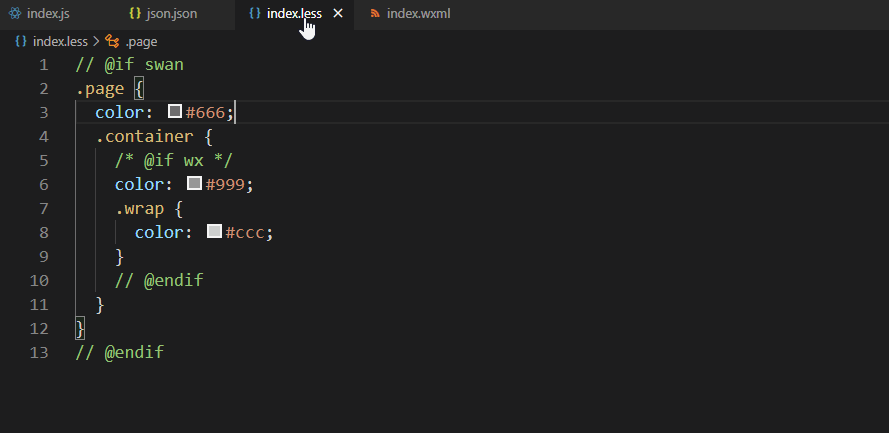
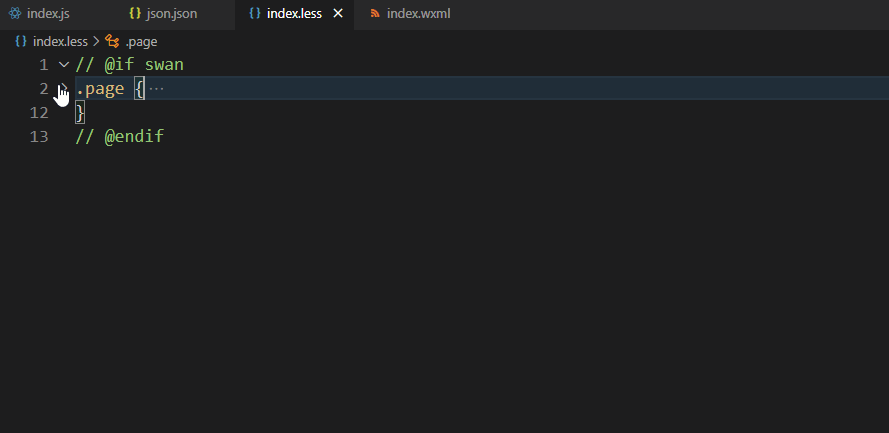

# vscode-jgb-plus README

This is an extension for enhance `jgb` code experience.

## Features

* highlight jgb platform comments

* enable folding matched comments

## Requirements

If you have any requirements or dependencies, add a section describing those and how to install and configure them.

## Extension Settings

Include if your extension adds any VS Code settings through the `contributes.configuration` extension point.

For example:

This extension contributes the following settings:

* `jgb-plus.multilineComments`: Whether the multiline comment highlighter should be active
* `jgb-plus.highlightPlainText`: Whether the plaintext comment highlighter should be active

## Known Issues

Calling out known issues can help limit users opening duplicate issues against your extension.

**Enjoy!**
